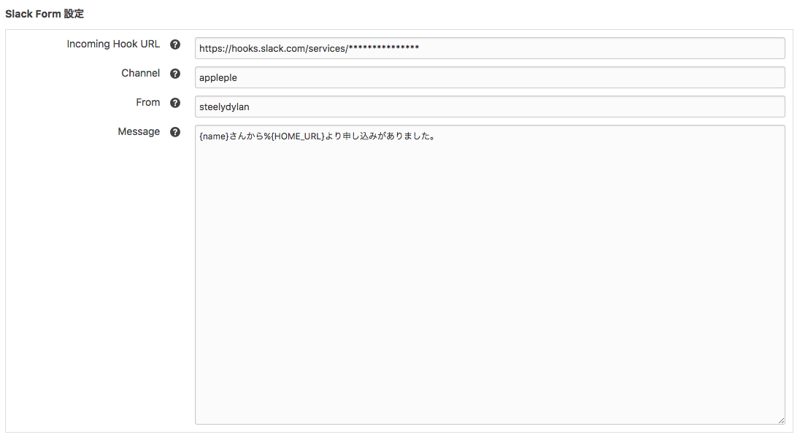
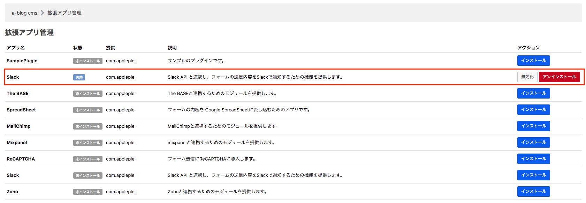
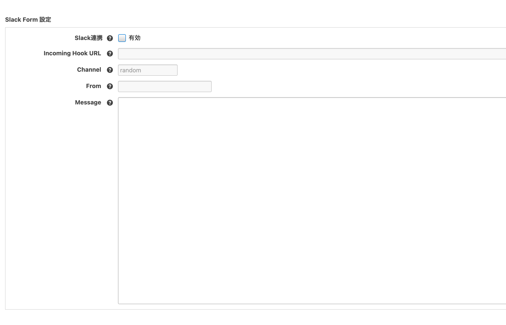

# Slack for a-blog cms

a-blog cms の 拡張アプリ「Slack for a-blog cms」を使うとフォームからデータが送信された段階でそのフォームのデータを加工し、slackに通知することができます。例えばフォームから「資料請求」などがあれば「資料請求がありました。」などとslackの好きなチャンネルに通知できます。

## 動作環境
- a-blog cms: >= Ver. 2.9.0

## ダウンロード
[Slack for a-blog cms](https://github.com/appleple/acms-slack/raw/master/build/slack.zip)

利用するためにはダウンロード後、/extension/pluginsに設置してください。

## 使い方
下の図のように、Slackに通知したいFormIDを指定し、メッセージの送信先チャネルを「Channel」に送信元の名前を「From」に設定します。またメッセージにはFormモジュールの変数と、グローバル変数を使用することができます。


## カスタマイズ手順
以下の3つのステップで a-blog cms と Slack を連携します。

1. Slackへの登録
2. Webhook URL の取得
3. a-blog cmsの拡張アプリ Slackに Webhook URL を登録

### 1. Slackへの登録
Slackのアカウントをお持ちでない方は下記のURLにてアカウントを作成しましょう。ある程度の機能までは無料で使うことができます。 https://slack.com/

### 2. Webhook URL の取得
下記のURLにてチャネルを指定して Webhook URL を取得します。ここで登録したチャネル以外のチャネルにもメッセージを飛ばすことはできますので好きなチャネルを指定して作成しましょう。 <br/>
https://slack.com/services/new/incoming-webhook

### 3. a-blog cmsの拡張アプリ Slackに Webhook URL を登録

管理ページ > 拡張アプリより「拡張アプリ管理」のページに移動します。そのページより下の図のようにSlackをインストールします。



インストール完了後は、管理ページ > フォーム > 連携したいフォームID よりSlackの管理ページに移動します。その後、「Webhook URL」という項目がありますので、その項目に先ほど覚えておいた Webhook URL を入力します。 これでa-blog cmsとSlackを連携させる準備は整いました。



#### その他の設定項目

##### Channel

チャンネル名を登録します。この時頭の「#」を除いたものを設定ください。
例えば「#random」チャンネルに投稿したい場合は、「random」を設定ください。

##### From

Slackに投稿される投稿者の名前を設定します。自由な値を設定ください。

##### Message

Slackに投稿されるメッセージ本文になります。メールのテンプレートと同じように、フィールド値や、グローバル変数を使用することが出来ます。最初試す時は、テキストのメールテンプレートをそのまま貼り付けると簡単にメッセージを用意できるので、おすすめです。


## 注意
config.server.phpでHOOKを有効にしておく必要があります。

```php
define('HOOK_ENABLE', 1);
```

